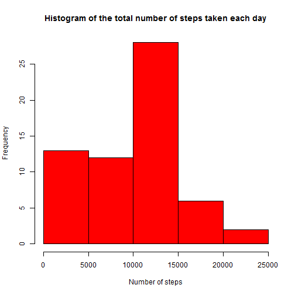
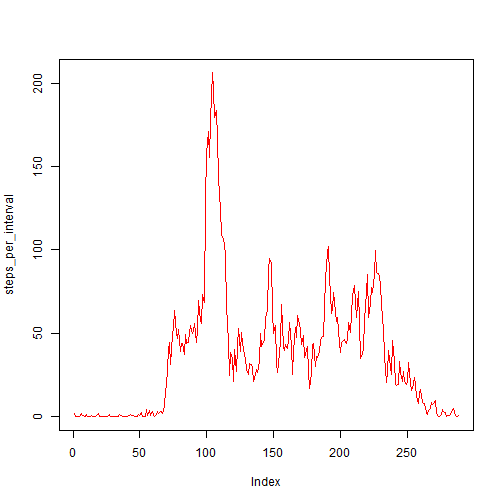
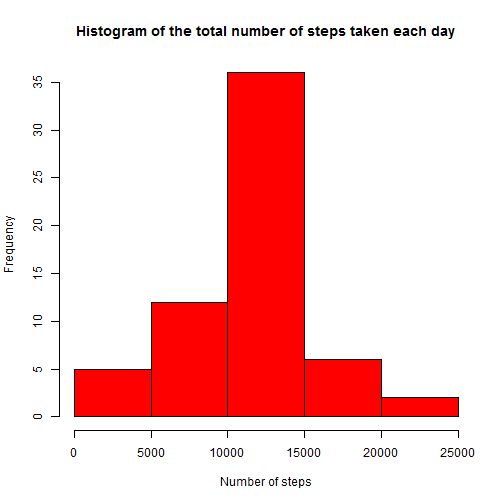

# Reproducible Research: Peer Assessment 1


```r
#Load required libraries
library(lattice)
```

## Loading and preprocessing the data


```r
if (!file.exists("activity.csv"))
  unzip("activity.zip")
activity <- read.csv("activity.csv")
activity$date <- as.Date(activity$date, "%Y-%m-%d")
```

## What is mean total number of steps taken per day?

```r
steps_per_day <- tapply(activity$steps,
                        activity$date,
                        sum,
                        na.rm = TRUE,
                        simplify = TRUE)
hist(steps_per_day,
     xlab = "Number of steps",
     main = "Histogram of the total number of steps taken each day",
     col = "red")
```

 


```r
steps_per_day_mean <- mean(steps_per_day)
steps_per_day_median <- median(steps_per_day)
```

The mean of total number steps per day is
9354.23  
The median of total number steps per day is
10395 

## What is the average daily activity pattern?

```r
steps_per_interval <- tapply(activity$steps, activity$interval, mean, na.rm = TRUE, simplify = TRUE)
plot(steps_per_interval, type = 'l', col = "red")
```

 

```r
max_interval_index <- names(which.max(steps_per_interval))
max_interval_value <- steps_per_interval[[as.character(max_interval_index)]]
```

Interval with index 835 contains the maximum number of
steps - 206.1698113

## Imputing missing values

```r
missing_values_count <- sum(is.na(activity))
```
Total number of missing values is 2304


```r
activity_without_nas <- activity
for (i in 1:nrow(activity_without_nas)) {
    obs <- activity_without_nas[i, ]
    if (is.na(obs$steps)) {
        obs$steps <- steps_per_interval[[as.character(obs$interval)]]
    }
    activity_without_nas[i, ] <- obs
}
```


```r
steps_per_day_no_nas <- tapply(activity_without_nas$steps,
                               activity$date,
                               sum,
                               simplify = TRUE)
hist(steps_per_day_no_nas,
     xlab = "Number of steps",
     main = "Histogram of the total number of steps taken each day",
     col = "red")
```

 


```r
steps_per_day_mean_no_nas <- mean(steps_per_day_no_nas)
steps_per_day_median_no_nas <- median(steps_per_day_no_nas)
```

The mean of total number steps per day without NAs is
10766.19  
The median of total number steps per day without NAs is
10766.19  

## Are there differences in activity patterns between weekdays and weekends?

```r
activity_without_nas$day_level <- as.factor(
    ifelse(weekdays(activity_without_nas$date) %in% c("суббота", "воскресенье"),
           "Weekend",
           "Weekday"))
steps_per_interval <- aggregate(steps ~ interval + day_level,
                                data = activity_without_nas,
                                mean)
names(steps_per_interval) <- c("interval", "day_level", "steps")
xyplot(steps ~ interval | day_level, 
       steps_per_interval,
       type = "l",
       layout = c(1, 2), 
       xlab = "Interval", ylab = "Number of steps")
```

 
